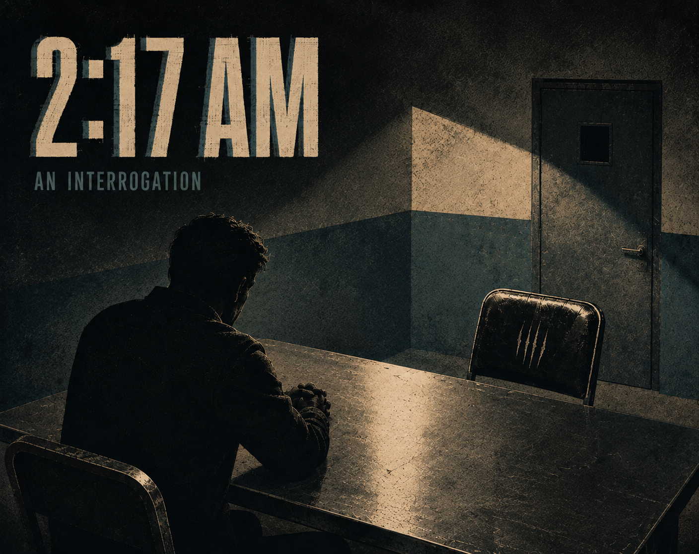

# 2:17 AM



A tense, choice-driven Twine thriller created for the UCA Twine Launch Week
Game Jam 26/27 theme **Evasion**.

You play Alex Vale, the driver in a fatal hit-and-run. At 2:17 AM, Detective
Mara Voss begins an unofficial interview and claims to possess a recording of
the collision. The player must decide which truths to reveal, which lies to
maintain, and whether to protect or betray Rowan—the intoxicated passenger who
cannot fully remember what happened.

## Current status

The complete story structure is scaffolded in Twee. The next step is to write
and implement each scenario, beginning with the waiting room.

## Project layout

- `src/story.twee` — SugarCube story source
- `docs/story-map.md` — narrative structure, state, routes, and endings
- `dist/` — exported playable HTML (not committed until a build exists)

## Build and play

From the repository folder, run:

```bash
./scripts/build.sh
```

The first build downloads Tweego and SugarCube into the ignored `.tools`
folder. Open `dist/2-17am.html` in a browser to play the result.

## Editing

The story targets SugarCube 2.37.3. Each section beginning with `::` in
`src/story.twee` is a Twine passage. Links such as `[[Begin->Waiting Room]]`
move the player from one passage to another.
